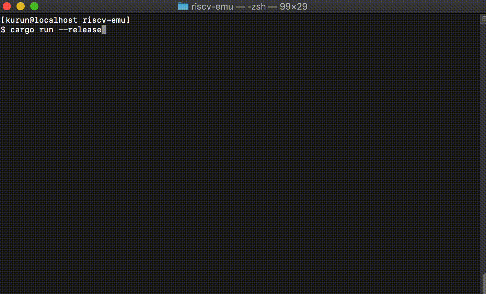
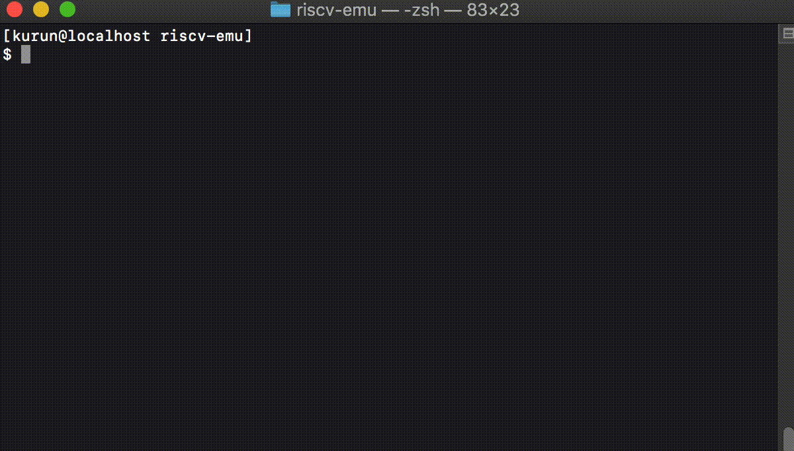

# riscv-emu


`riscv-emu` is the RISC-V emulator that is written in Rust. This RISC-V emulator supports Linux, xv6, NuttX, FreeRTOS and Zephyr OS.

## Usage

```
$ ../target/release/riscv_emu_desktop [options]
Options:
    -k, --kernel        Kernel image file
    -f, --filesystem    File system image file
    -d, --dtb           Device tree binary file
    -m, --machine       Target machine (SiFive_e|SiFive_u|Qemu_virt)
    -t, --testmode      Testmode is enabled
    -h, --help          Help message
```

### Run on desktop terminal

```
git clone https://github.com/HidenoriMatsubayashi/riscv-emu.git
cd desktop
cargo build --release
```

#### Linux

```
../target/release/riscv_emu_desktop \
        -k ../artifacts/linux/fw_payload.elf \
        -m Qemu_virt \
        -d ../artifacts/linux/dtb/qemu_virtio.dtb \
        -f ../artifacts/linux/rootfs.img
```


#### NuttX

```
../target/release/riscv_emu_desktop -k ../artifacts/nuttx/nuttx -m SiFive_e
```



#### xv6

```
../target/release/riscv_emu_desktop \
        -k ../artifacts/xv6/kernel \
        -m Qemu_virt \
        -f ../artifacts/xv6/fs.img
```


#### FreeRTOS

```
../target/release/riscv_emu_desktop -k ../artifacts/freertos/RTOSDemo.elf -m SiFive_e
```

#### Zephyr

```
../target/release/riscv_emu_desktop -k ../artifacts/zephyr/zephyr.elf -m SiFive_e
```



#### User bare-metal programs

```
../target/release/riscv_emu_desktop -k ../tests/bin/rv32ui-p-add -t
```

## Tests

### Regression Tests (risc-tests)

```
cargo test
```

## Support Status

### Instructions

- [x] RV32/64I
- [x] RV32/64M
- [ ] RV32/64F
- [ ] RV32/64D
- [ ] RV32/64V
- [x] RV32/64A
- [x] RV32/64C (Almost implemented)

### Virtual Memory

- [x] SV32
- [x] SV39
- [ ] SV48
- [ ] SV57
- [ ] SV64

### SoC/Peripherals

#### General
- [x] Uart (UART 16550)
- [x] Virtio Disk

#### [FU540-C000](https://static.dev.sifive.com/FU540-C000-v1.0.pdf)
- [x] CLINT (Timer)
- [x] PLIC (Interrupt Controller)

#### [FE310](https://static.dev.sifive.com/FE310-G000.pdf)
- [x] UART
- [x] PRCI
- [x] GPIO
- [x] SPI Flash
- [x] DTIM (SRAM)

### Support OS

 - [Linux]()
 - [Nuttx](https://bitbucket.org/nuttx/nuttx/src/master/)
 - [xv6-riscv](https://github.com/mit-pdos/xv6-riscv)
 - [FreeRTOS](https://www.freertos.org/)
 - [Zephyr](https://www.zephyrproject.org/)

## Links

- [riscv/riscv-tests](https://github.com/riscv/riscv-tests)
- [RISC-V - Getting Started Guide](https://risc-v-getting-started-guide.readthedocs.io/en/latest/index.html)
